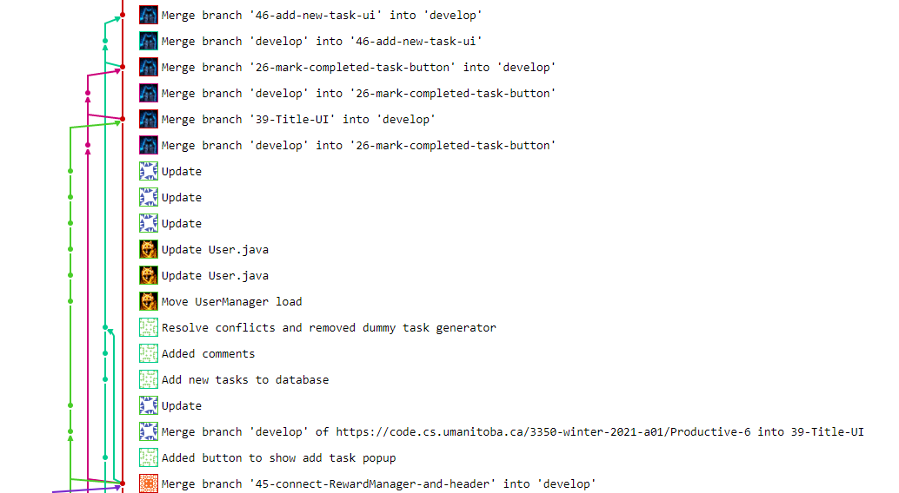

Iteration 1 Worksheet
=====================

Adding a feature
-----------------

Tell the story of how one of your features was added to the project.
Provide links to the
feature, user stories, and merge requests (if used), associated tests, and merge commit
that was used complete the feature.

Use one or two paragraphs which can have point-form within them.

Exceptional code
----------------

Provide a link to a test of exceptional code. In a few sentences,
provide an explanation of why the exception is handled or thrown
in the code you are testing.

In the TaskManagerTest.java, we tested an the TaskManager's validation of the priority
field of a task.
https://code.cs.umanitoba.ca/3350-winter-2021-a01/Productive-6/-/blob/develop/app/src/test/java/com/productive6/productive/TaskManagerTest.java#L145

In this specific code, we chose to go with a 'throw error if input data in invalid' approach.
The user will eventually be able to enter a custom value in for the 'priority' of a task.
In order to prevent the user from entering extraneous negative values, we do some validation in the logic layer
that the provided priority is not negative. If it is, an appropriate descriptive exception is thrown, that
later should be meaningfully displayed to the user.

Branching
----------

Provide a link to where you describe your branching strategy.

Provide screen shot of a feature being added using your branching strategy
successfully. The [GitLab Graph tool can do this](https://code.cs.umanitoba.ca/comp3350-summer2019/cook-eBook/-/network/develop),
as well as using `git log --graph`.

[Branching Stratagy](BranchingStratagy.md)

SOLID
-----

Find a SOLID violation in the project of group `(n%12)+1` (group 12 does group 1).
Open an issue in their project with the violation,
clearly explaining the SOLID violation - specifying the type, provide a link to that issue. Be sure
your links in the issues are to **specific commits** (not to `main`, or `develop` as those will be changed).

Link to issue:
https://code.cs.umanitoba.ca/3350-winter-2021-a01/umhub-7/-/issues/35

Agile Planning
--------------

Write a paragraph about any plans that were changed. Did you
'push' any features to iteration 2? Did you change the description
of any Features or User Stories? Have links to any changed or pushed Features
or User Stories.

Our group decided to push back [Schedule Due Dates](#19) to iteration 2. Because we spent a lot of time on getting the database with UI ready
and also cleaned up all the bugs. Although we have created UI to pick due date but it took longer than we expected to integrate the button to the create task popup window.
By leaving it to iteration 2, we can spend time on recheck our previous code and get those work correctly before moving on.
Therefore, [Schedule Due Dates](#19) will be pushed back for us to be more convenient in this iteration.